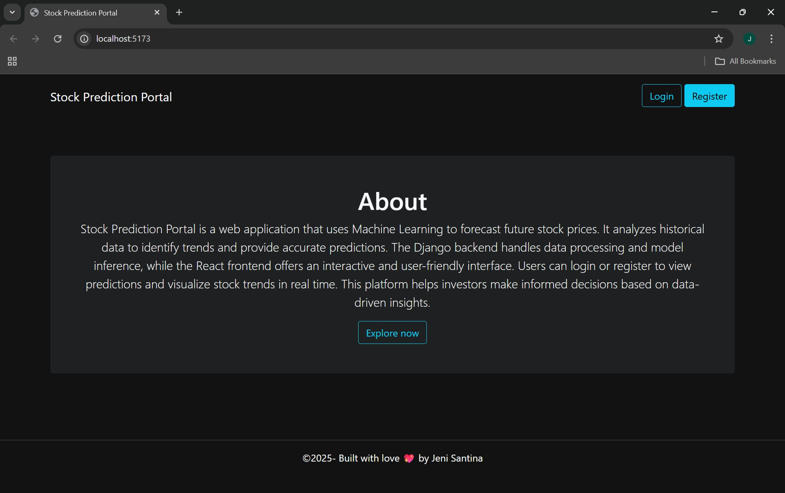
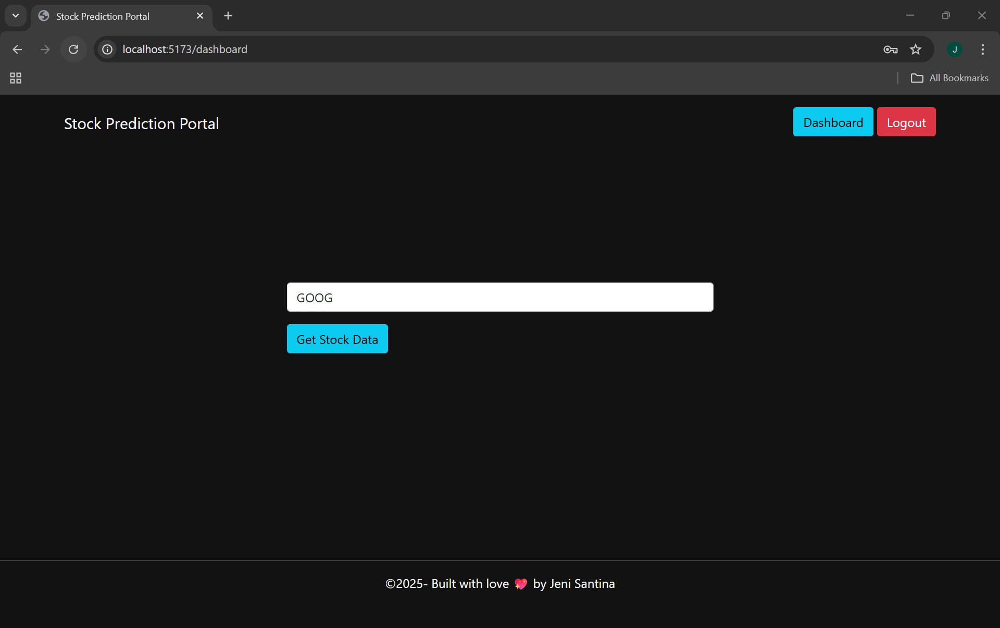
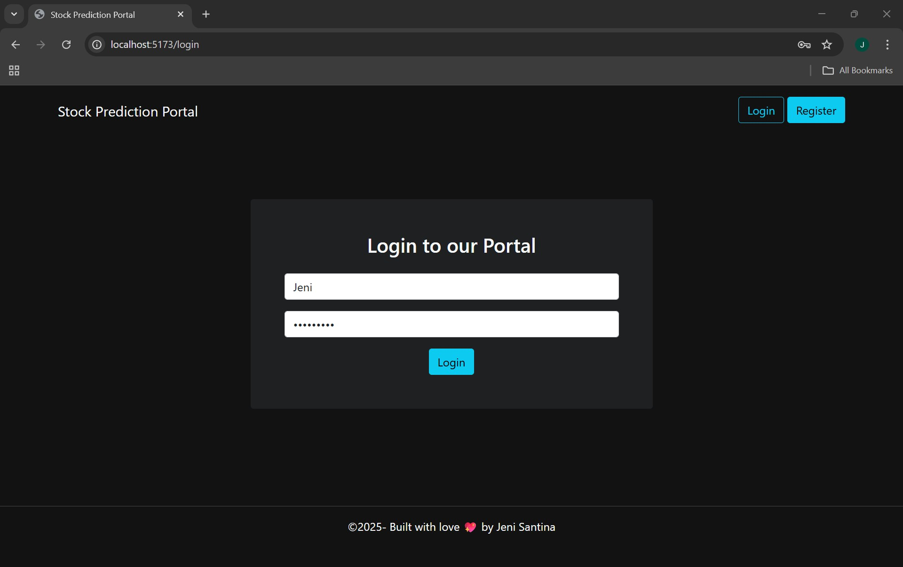
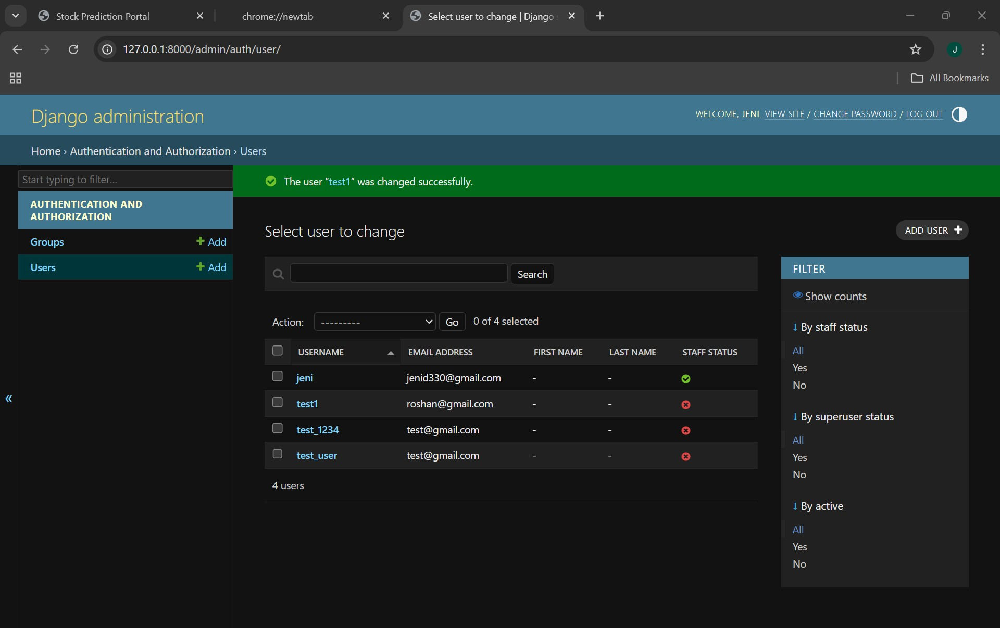
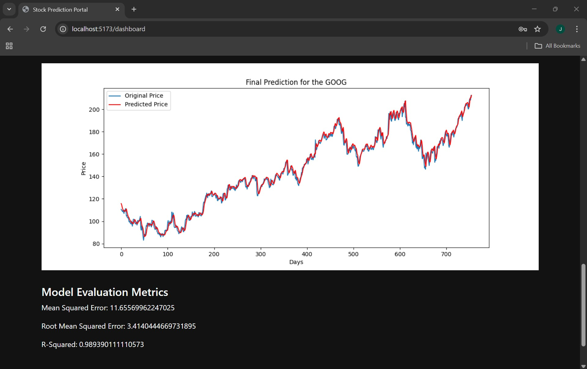

# 🚀 Stock Prediction Portal

A **full-stack stock prediction web application** that predicts future stock prices using **LSTM neural networks**, visualizes historical trends, and provides actionable insights. Built with **React frontend**, **Django REST API backend**, and **real-time data visualization**.

---

## 🌟 Features

- **📈 Stock Price Prediction:** Predict future stock prices using deep learning (LSTM).
- **📊 Historical Trends:** Interactive charts for historical stock performance.
- **📉 Moving Averages:** Display 100-day & 200-day moving averages for trend analysis.
- **🔒 User Authentication:** Secure registration & login with JWT tokens.
- **⚡ Real-Time Updates:** Dynamic fetching of latest stock data.
- **💻 Responsive UI:** Works seamlessly on desktop and mobile.

---

## 🛠 Tech Stack

- **Frontend:** React, JavaScript, HTML5, CSS3, Axios  
- **Backend:** Django, Django REST Framework, Python  
- **Database:** SQLite / PostgreSQL  
- **Machine Learning:** TensorFlow / Keras (LSTM Model)  
- **Visualization:** Chart.js / Plotly  
- **Authentication:** JWT  
- **Version Control:** Git & GitHub  

---

## Installation and setup

# Clone repository
git clone https://github.com/yourusername/stock-prediction-portal.git
cd stock-prediction-portal

# Backend setup
cd backend
python -m venv venv
source venv/bin/activate       # Linux/macOS
venv\Scripts\activate          # Windows
pip install -r requirements.txt
python manage.py migrate
python manage.py runserver

# Frontend setup (in a new terminal or after backend)
cd ../frontend
npm install
npm start

## 🎯 Usage

Open the app in your browser.  
Register or log in.  
Enter a stock ticker symbol (e.g., AAPL for Apple).  

Explore:  

- Predicted future stock prices 📈  
- Historical trends 📊  
- Moving averages (100-day & 200-day) 📉  

Make informed decisions based on predictions.

Make informed decisions based on predictions.

🖼 Screenshots:

